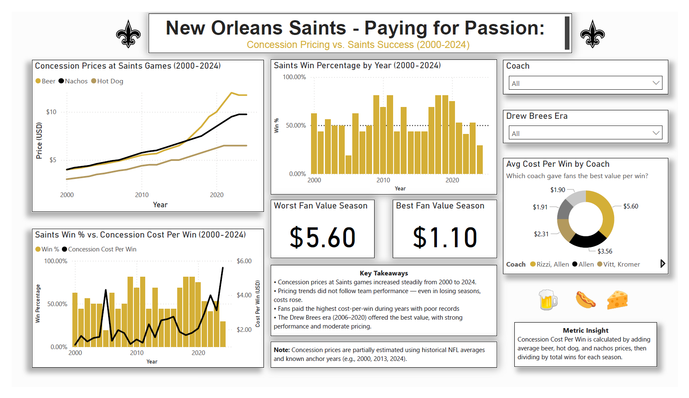

# 🏈 New Orleans Saints – Paying for Passion

This Power BI dashboard explores the relationship between team success and fan concession spending at New Orleans Saints home games from 2000 to 2024.

## 📊 Dashboard Overview

The dashboard includes:

- **Custom KPI**: *Concession Cost Per Win* — total average beer, hot dog, and nacho price divided by yearly wins
- **Combo Chart**: Win % vs. Cost Per Win
- **Year-over-Year Price Trends**: Each item visualized individually
- **Coach Comparison**: Average concession cost by head coach
- **KPI Cards**: Best and worst fan value seasons
- **Slicers**: Coach, Drew Brees era filters
- **Tooltips & Summary**: Explanation of custom metric and insights

## 📷 Screenshot

## 🛠 Tools Used

- Power BI Desktop
- DAX Measures
- Microsoft Excel

## 📁 Files

| File                             | Description                          |
|----------------------------------|--------------------------------------|
| Saints_Dashboard.png             | Exported visual of dashboard         |
| Saints_Dashboard.pbix            | Power BI file                        |
| Saints Concessions Pricing.csv   | Cleaned data source                  |
| Saints Win Ratio.xlsx            | Cleaned data source                  |

---

## 🙌 Contact

Built by [Dominic Madona]  
[www.linkedin.com/in/contactdominicmadona]
